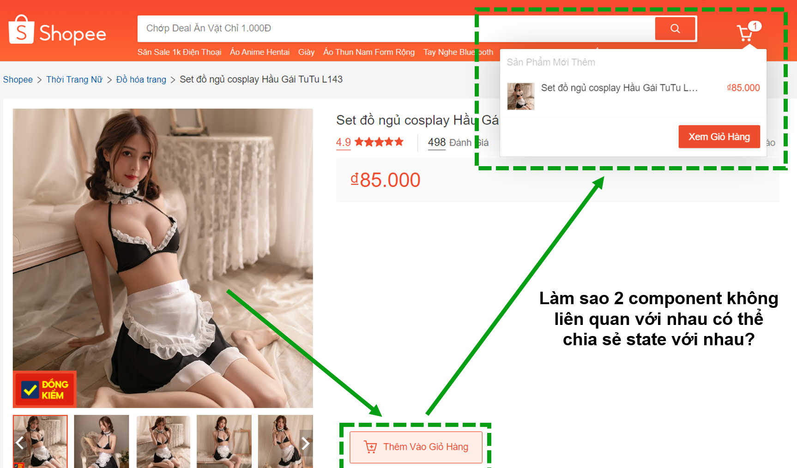
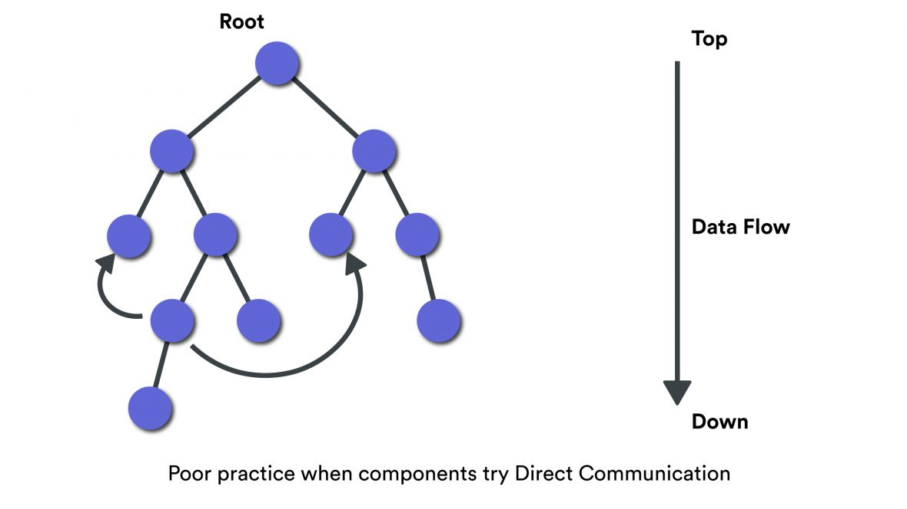
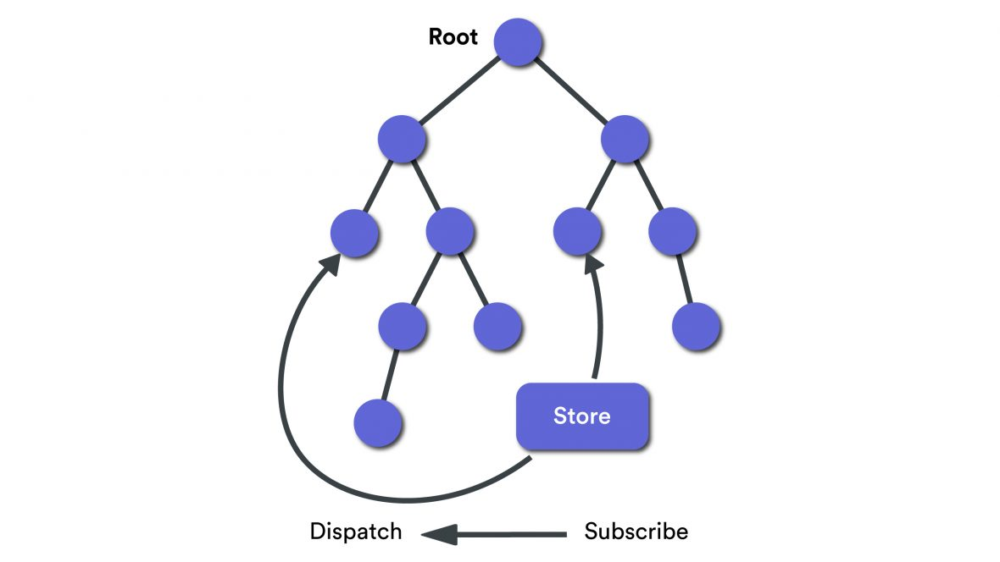
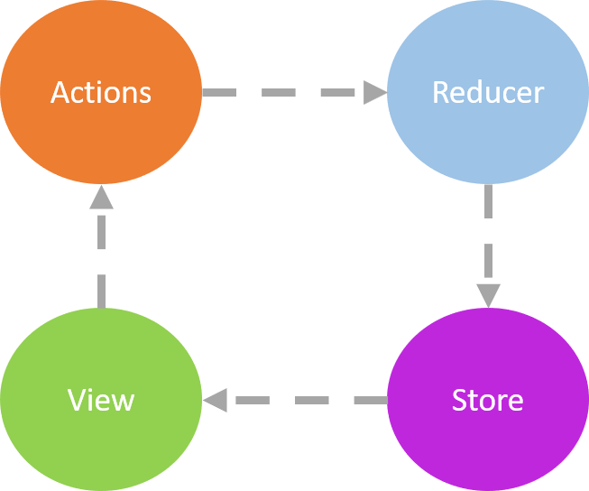

# Yêu cầu của bài toán

Khi code ở một dự án E-com thì rõ ràng tính năng giỏ hàng là điều bắt buộc, vậy làm sao để dữ liệu của sản phẩm có thể được hiển thị ở trên giỏ hàng sau khi người dùng click vào "Thêm sản phẩm"?




## Cách đơn giản nhất là đẩy ngược lên trên 🚲

Như chương 1 mình đã đề cập, state sẽ được khai báo ở thằng parent chung nhất của tất cả component sử dụng đến state đó. Lúc này dữ liệu sẽ được đẩy qua các cấp của component từ nơi thay đổi cho đến thằng parent đấy.



### Khó khăn thấy rõ 

👉 Dữ liệu đi qua nhiều component không sử dụng đến chúng.

👉 Khó bảo trì, kiểm soát được luồng code.

👉 React cũng không khuyến khích sử dụng cách này vì có thể dẫn tới `spaghetti code`, [Tham khảo spaghetti code là gì?][spaghetti-code].


## Cách tiếp theo là ném vào 1 cái `kho chứa` của redux để dùng chung 🏛

Redux cung cấp cho chúng ta một nơi tập trung gọi là `store` giúp chúng ta lưu trạng thái ứng dụng của mình. 

Để cập nhật `store`, component nguồn phải phát ra một `action`, về cơ bản là một đối tượng mô tả sự kiện cùng với trạng thái mới. 

Sau khi `store` được cập nhật, các component mà là các `subscriber` (Gọi là `listeners` cũng được) sẽ nhận được trạng thái cập nhật như trong sơ đồ bên dưới.




## Các Khái Niệm Chính (Chỉ cần nhớ keyword thôi, mình sẽ ví dụ cụ thể ở phần Oneway Binding )

### 1. **State**
State đại diện cho toàn bộ trạng thái của ứng dụng trong một đối tượng JavaScript duy nhất.

### 2. **Action**
Action là một đối tượng JavaScript đơn giản mô tả một thay đổi xảy ra trong state của ứng dụng. Mỗi action phải có một thuộc tính `type` mô tả loại hành động đang xảy ra và có thể chứa các thuộc tính khác để truyền dữ liệu bổ sung.

```javascript
{
  type: 'ADD_TODO',
  payload: { text: 'Learn Redux' }
}
```

### 3. **Reducer**
Reducer là một hàm nhận vào state hiện tại và một action, sau đó trả về state mới. Reducer không thay đổi state hiện tại mà tạo ra một bản sao mới với các thay đổi cần thiết. Các state này được lưu trữ dưới dạng đối tượng và chúng xác định trạng thái của ứng dụng thay đổi như thế nào để đáp ứng với hành động được gửi đến "store".

```javascript
function todos(state = [], action) {
  switch (action.type) {
    case 'ADD_TODO':
      return [
        ...state,
        {
          text: action.payload.text,
          completed: false
        }
      ];
    default:
      return state;
  }
}
```

### 4. **Store**
Store là nơi lưu trữ state của ứng dụng và là nơi duy nhất mà state có thể được cập nhật thông qua việc `dispatch` đi các actions. Chỉ có một "store" trong bất kỳ ứng dụng Redux nào. Store cung cấp các phương thức để truy cập state, dispatch actions, và đăng ký các listeners/subcribers để lắng nghe thay đổi state.

### 5. **Slide**
Khái niệm cộng gộp giữa Reducer và Action


## Giới thiệu mô hình Oneway Binding (One-way data flow)

Đây là một ví dụ nhỏ về "One-way data flow" trong React


* Chúng ta sẽ bắt đầu từ `state`, các trạng thái này sẽ định hình cách `view` hiển thị tại một thời điểm cụ thể sẽ như thế nào.

* `View` nói chung là những thứ mà người dùng có thể thấy và thao tác được, việc thao tác này sẽ được gọi là các `action`, ví dụ như `clicking trên 1 button`, `scroll` hoặc `submit`... 

* Các `Action` sẽ tác động và làm thay đổi các `state`, rồi `state` lại thay đổi `view` và cứ như vậy nó trở thành 1 "vòng" dữ liệu 1 chiều khép kín.

> Vậy còn "One-way data flow" khi có Redux trông sẽ như thế nào?



👉 Bạn sẽ phải để ý kỹ những vòng tròn trên hình là nơi data sẽ được lưu chuyển, và mình sẽ ký hiệu nó là `🎁` bên dưới giải thích sau:

* `Store` là một cái kho để chứa và quản lý trạng thái (state), có thể truy cập để lấy trạng thái (state) ra, update state hiện có, và listener để nhận biết xem có thay đổi gì không, và cập nhật qua views..

* `View` vẫn là nơi hiển thị dữ liệu từ `store` như ở trên. Lúc này người dùng sẽ thực hiện một `action` hướng tới việc thay đổi state để hiển thị `view` như mong muốn.

* `Action` được tạo ra, đây là bước khởi đầu của luồng dữ liệu, data `🎁` sẽ được bỏ vào trong thuộc tính `payload` của nó để `dispatch` tới `store`, ở bước này các bạn sẽ thắc mắc là nếu như vậy thì nó đâu giống trên hình, thí chủ xin hãy đợi chút, lúc này `store` chỉ đóng vai trò trung gian, đảm bảo rằng `action` đến đúng nơi xử lý, nên sẽ không tính hehe.

* `Store` gửi `action` này tới `reducer` thích hợp.

* `Reducer` nhận `state` hiện tại và `action` , lúc này `state` hiện tại có thể sẽ được thêm ,cập nhật, xóa tùy vào data `🎁` nằm trong payload của `action`, sau đó trả về state mới dựa trên logic trong `reducer`.

* `Store` lưu trữ `state` mới `🎁`, và các component React được kết nối với `store` sẽ tự động cập nhật giao diện dựa trên `state` mới `🎁` này.

> Thế là trở thành 1 vòng tròn dữ liệu khép kín rồi đúng không nào (～￣▽￣)～ 

## Kết luận

Trong chương này mình đã đưa ra yêu cầu của bài toán và cách giải quyết nó, ở chương sau mình sẽ đi kỹ từng khái niệm nêu trên để bạn dễ hình dung hơn 

___
### 🐱‍🏍Đi tới bài tiếp theo -> [Chương 3.2-Redux Store][link-chuong-3.2]

[link-chuong-3.2]: https://en.wikipedia
[spaghetti-code]: https://en.wikipedia.org/wiki/Spaghetti_code