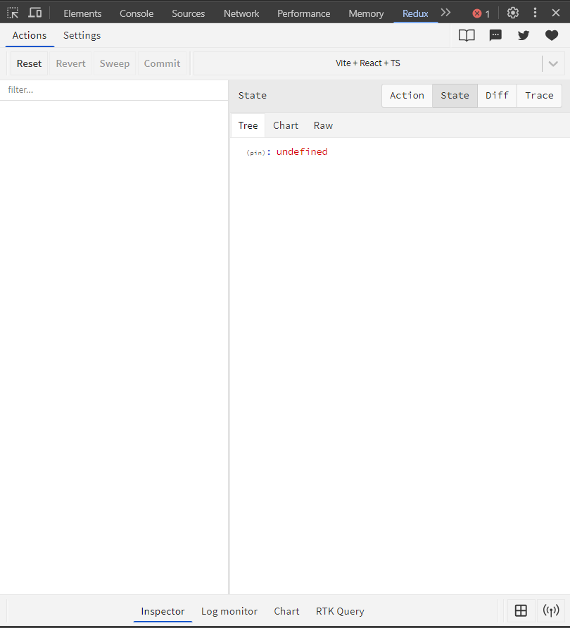
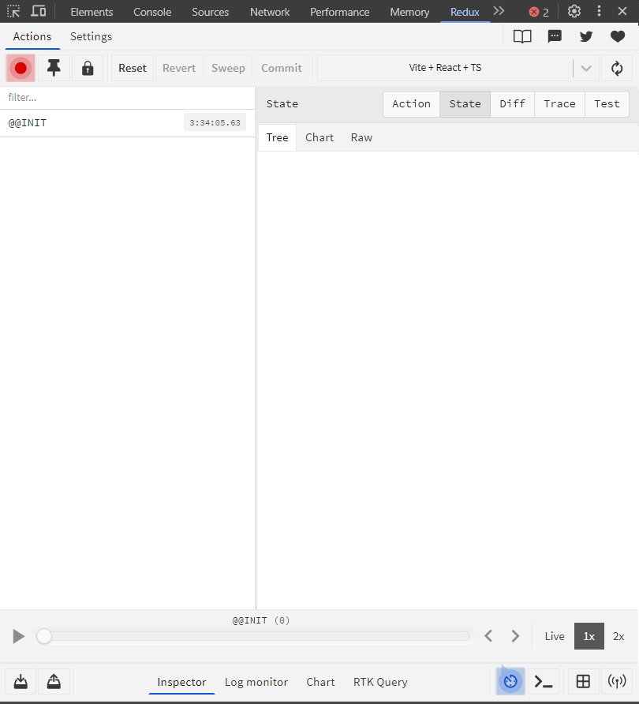

# Redux store

## 1. Giới thiệu 👶

Như chương trước đó, mình đã giới thiệu về Store rất kỹ về lý thuyết, bây giờ mình sẽ hướng dẫn các bạn thực hành để tạo ra 1 `store` cho dự án của mình.

## 2. Bắt đầu 🚀 

### 2.1. Tạo thư mục tên là `redux`

Bạn sẽ tạo thư mục tên là "redux" nằm trong thư mục "src" nha, đây sẽ là nơi định nghĩa các logic để triển khai redux cho dự án của bạn:

```
public
src/
├── assets/             
├── redux/ 
...
```

Tiếp theo chúng ta sẽ tạo file `store.ts` trong thư mục redux, nơi đây chính là `store` của dự án.

```typescript
import { configureStore } from '@reduxjs/toolkit'

export const store = configureStore({
    reducer: {

    }
})

// `RootState`: Kiểu đại diện cho toàn bộ state trong Redux store.
export type RootState = ReturnType<typeof store.getState>

// `AppDispatch`: Kiểu đại diện cho hàm dispatch của Redux store, giúp bạn sử dụng dispatch với kiểu dữ liệu chính xác.
export type AppDispatch = typeof store.dispatch

// `AppStore`: Kiểu đại diện cho toàn bộ Redux store, giúp TypeScript hiểu và kiểm tra kiểu của store trong ứng dụng.
export type AppStore = typeof store

// Chung quy là nó sẽ giúp các bạn code Redux với Typescript dễ dàng hơn nè
```

Với đoạn code trên thì các bạn có thể thấy như mình đã đề cập ở chương trước thì `store` sẽ chứa các `reducer`, nhưng hiện tại chưa có `reducer` nên mình đang để trống

### 2.2. Sửa đổi trong file `main.tsx`

Sau khi đã tạo xong 1 `store` bạn phải nói với react rằng chúng ta đang có một `store`, tôi cần bạn đưa toàn bộ các state cần quản lý chung vào đấy mà không quan tâm nó nằm ở nút con sâu như thế nào.

```typescript
import { StrictMode } from 'react'
import { createRoot } from 'react-dom/client'
import App from './App.tsx'
import './index.css'
import { Provider } from 'react-redux'
import { store } from './redux/store.ts'


createRoot(document.getElementById('root')!).render(
  <StrictMode>
   {/* Chúng ta sẽ cấp cho App một store được lấy từ file store.ts của chúng ta */}
    <Provider store={store}>
      <App />
    </Provider>
  </StrictMode>,
)
```

### 2.3. Kiểm tra trong Redux devtools

Giờ bạn hãy thử chạy dự án và mở Redux devtools (f12) xem state lúc này đang là "rỗng", khác với lúc chúng ta chưa cấp cho app một `store` là "undefined"

| ⭐Trước khi cấp store  | 🏂 Sau khi cấp store |
| ---------------------- | --------------------- |
|  |  |

## Kết luận

Vậy là chúng ta đã hoàn thành xong bước tạo ra `store` cho ứng dụng của mình rồi đó, ở chương sau mình sẽ giới thiệu tới các bạn khái niệm `slide` trong redux toolkit

___
### 🐱‍🏍Đi tới bài tiếp theo 🚍 [Chương 3.1-Redux Slice][link-chuong-3.3]


[link-chuong-3.3]: https://github.com/TranDatk/Redux-toolkit_Redux-Saga_React-Query_Learning/tree/main/
